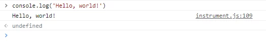
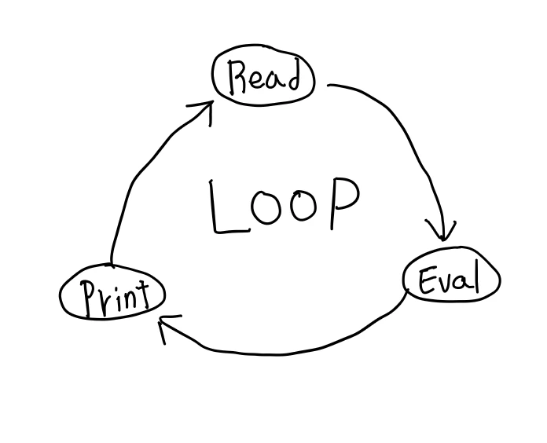
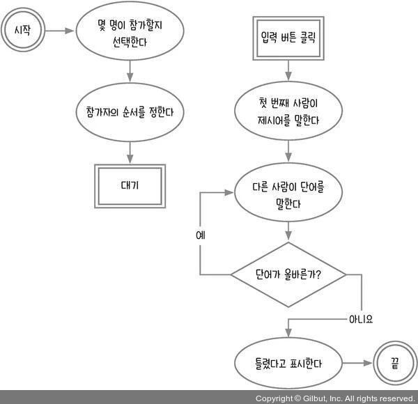
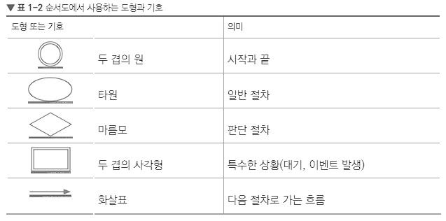

# Hello, JavaScript

- [이 책과 강의를 학습하는 목적](#이-책과-강의를-학습하는-목적)
- [저자의 인사말](#저자의-인사말)
- [1.1 자바스크립트를 시작하기 전에](#11-자바스크립트를-시작하기-전에)
  - [자바스크립트를 배울 때 도움 되는 자료](#자바스크립트를-배울-때-도움-되는-자료)
  - [프로그램 설치](#프로그램-설치)
  - [자바스크립트 코드 실행](#자바스크립트-코드-실행)
    - [흔하게 발생하는 에러](#흔하게-발생하는-에러)
    - [인터프리터와 컴파일](#인터프리터와-컴파일)
    - [REPL(Read-Eval-Print-Loop)](#replread-eval-print-loop)
- [1.2 프로그래밍 사고력 기르기](#12-프로그래밍-사고력-기르기)
  - [순서도를 그리는 방법](#순서도를-그리는-방법)
    - [순서도 그리기 웹 도구 추천](#순서도-그리기-웹-도구-추천)

## 이 책과 강의를 학습하는 목적

[Let’s Get IT 자바스크립트 프로그래밍 : 네이버 도서](https://search.shopping.naver.com/book/catalog/32438311618?query=let%27s%20get%20it%20%EC%9E%90%EB%B0%94%EC%8A%A4%ED%81%AC%EB%A6%BD%ED%8A%B8%20%ED%94%84%EB%A1%9C%EA%B7%B8%EB%9E%98%EB%B0%8D&NaPm=ct%3Dlegv0isw%7Cci%3D25849ff889f3469e1467f6e4bc913d2d214f95ff%7Ctr%3Dboksl%7Csn%3D95694%7Chk%3D104c7472d25a284d40fcff99116686adcb051716)

내가 이 책을 선택하고 학습하는 이유는, 이전에 Node.js 교과서 개정 2판을 읽고 '제로초(조현영)님이 쓴 책이면 믿고 읽을 수 있다.'라는 마음도 있었고, 프로그래밍 사고력을 기르는 데 도움이 될만한 책이기 때문이다.

사놓고 읽지 않고 방치해뒀었는데, 알고 있던 것들도 복습할 겸, 사고력을 다시 한번 체크하고 부족한 부분이나 더 성장할 수 있는 부분이 있을 것이라 믿고 가보는 거다. 그리고 **내가 알고 있다고 착각하는 것은 아닐까?**라는 생각도 들기 때문에 부단히 공부하고, 체크하고, 배웠던 것을 설명해보는 시간을 가져봐야겠다.

인프런에서 무료로 강의도 제공하고 있다. 책이 없는 사람도 길벗 IT 도서 서비스인 [Thebook](https://thebook.io/080270/)에서 읽을 수 있다.

## 저자의 인사말

> 자바스크립트 문법에 대한 자료는 많습니다. 하지만 프로그래밍은 인터넷에서 검색한다고 해서, 책을 한 번 읽는다고 해서 바로 익힐 수 있는 게 아닙니다. 손에 익을 때까지, 머릿속에 남을 때까지 반복해서 학습하는 과정이 필요합니다.
>
> **이 책에서 가장 중요한 것은 '프로그래밍 사고력 기르기'입니다.**
>
> 순서도를 눈으로만 보는 게 아니라 직접 손으로 그려 보고, 해답을 보기 전에 1분 퀴즈와 셀프체크를 먼저 풀어보세요. 그래야만 프로그래밍 사고력이 길러집니다. 그리고 책을 다 읽은 후에는 여러분만의 웹 게임, 웹 사이트를 만들어 보세요. 웹 게임과 웹 사이트는 많이 다르다고 생각할 수 있지만, 이 책에서 안내하는 것처럼 순서도를 먼저 그리고 순서도를 코드로 옮기는 과정은 똑같습니다. 더 나아가 웹이 아닌 모바일 앱, 데스크탑 프로그램도 모두 마찬가지입니다.
>
> 향후 공부 방향을 조언해 줄 멘토를 구하는 것도 좋은 방법입니다. 멘토를 구하기 어렵다면 제 블로그나 유튜브 채널에 글을 남겨 주세요. 어느 정도 방향을 잡아드리겠습니다.  
>
> \- 제로초(조현영) -

## 1.1 자바스크립트를 시작하기 전에

### 자바스크립트를 배울 때 도움 되는 자료

- 모던 자바 스크립트 튜토리얼(<https://ko.javascript.info/>)
- MDN 웹 문서(<https://developer.mozilla.org/ko/docs/Web/JavaScript>)

### 프로그램 설치

코드 에디터로 저자는 JetBrains에서 만든 [WebStorm](https://www.jetbrains.com/ko-kr/webstorm/)을 추천하지만 유료이기 때문에

무료 중에 가장 사랑 받고있는 MS에서 만든 [VSCode](https://code.visualstudio.com/) 프로그램을 사용하여 진행한다.

웹 브라우저는 [크롬(Chrome)](https://www.google.com/intl/ko_kr/chrome/)으로 진행한다.

### 자바스크립트 코드 실행

크롬에서 개발자 옵션(윈도우는 F12, 맥은 Option + Command + i)을 열고 Console 탭으로 이동한다.

그리고 흰색 화면을 클릭하고 console.log('Hello,world!')를 입력 후 엔터를 치면 Hello, world!라고 찍힌다.

#### 흔하게 발생하는 에러

책에서 흔하게 발생하는 에러 유형 4가지를 소개한다.

- **Uncaught ReferenceError: consle is not defined**  
console 입력 중에 오타(consle, comsole 등)가 나면 발생하는 에러입니다.console은 브라우저에서 제공하는 기능이기 때문에 오타가 나면 안 됩니다.또한, 대소문자도 구분하므로 모든 글자는 소문자로 적어야 합니다.
- **Uncaught TypeError: console.lg is not a function**
console은 제대로 입력했으나 log에서 오타가 나면 발생하는 에러입니다. log는 console의 기능 중 일부라서 이 역시 오타가 나서는 안 됩니다. 대소문자도 구분하고요.
- **Uncaught SyntaxError: missing ) after argument list**
따옴표를 사용하지 않았을 때 발생하는 에러입니다. ‘Hello, world!’ 같은 문자는 \`(백틱)이나 '(작은따옴표) 또는 "(큰따옴표)로 감싸줘야 합니다.
- **Uncaught SyntaxError: Invalid or unexpected token**
따옴표의 짝을 맞추지 않았을 때 발생하는 에러입니다. ‘Hello, world!’ 같은 문자는 따옴표로 감싸 줘야 한다고 했죠? 이때 시작과 끝의 따옴표 종류가 같아야 합니다. 예를 들어, 시작이 작은따옴표였으면 끝도 작은따옴표여야 합니다.

위에서 언급한 에러 외에도 다양한 에러가 발생한다. 대부분 에러는 오타 때문에 발생 한다.

**프로그램은 문법 실수나 오타가 하나만 있어도 에러가 발생한다.** **오타를 찾는 매의 눈이 필요하다!**

#### 인터프리터와 컴파일

자바스크립트 처럼 코드를 한 덩어리씩 실행해 결과를 출력하는 방식을 **인터프리터(Interpreter)** 방식이라고 한다. 한 덩어리라고 표현한 이유는 Shift + Enter를 누르면 줄바꿈해서 여러 줄의 코드를 동시에 입력할 수 없기 때문이다.

자바스크립트와는 반대로 코드를 컴퓨터가 이해할 수 있는 언어로 변환하는 과정을 거친 후 한 번에 실행하는 방식을 **컴파일(Compile)** 방식이라고 한다. C나 C++, 자바 등의 언어가 이 방식을 사용한다.

#### REPL(Read-Eval-Print-Loop)

브라우저의 콘솔은 코드를 한 줄씩 입력받고(Read), 받은 입력을 평가(Eval)하고, 결과를 출력(Print)한 뒤, 다시 프롬프트가 나타나 새로운 입력을 기다리는 과정을 반복한다(Loop). 이러한 특성 때문에 콘솔을 REPL(Read-Eval-Print-Loop)라고 한다.

   

## 1.2 프로그래밍 사고력 기르기

'몇일'이라는 단어를 알고 있나? 이 질문에 대한 반응은 크게 두가지로 나뉘는데, '알고 있다'와 '맞춤법이 틀린 단어'(며칠이 맞습니다)라는 반응이다. 반응이 중요한 것이 아니라 이 단어를 알고 있다는 사실이 중요하다.

그런데 **이 단어를 알고 있다는 사실을 어떻게 알았을까?** 뇌를 다 뒤져보지 않아도 순식간에 '몇일' 또는 '며칠'이라는 단어가 떠올랐을 것이다.

**사람에게는 직관적으로 생각하는 습성이 있기 때문이다.** 사람은 어떠한 질문을 받을 때 직관적으로 떠오른 것을 대답하는 경우가 많다. 직관에서 어긋나는 대답을 하려면 많은 훈련이 필요하다.

컴퓨터는 자신이 이 단어를 아는지 모르는지 판단하기 위해 컴퓨터에 저장된 단어를 모두 찾아봐야 한다. 이렇듯 사람과 컴퓨터는 사고하는 방식이 다르다.

예시로, 사람은 무의식적으로 핸드폰을 만지며 걷다가 정신을 차려보니 어느덧 원하는 위치에 도착했음을 알아차리는 경우가 있다. 하지만 컴퓨터에게는 '50m 직진하고  우회전해 100m를 가면 집에 도착한다.'라는 정확한 명령을 내려야한다. **컴퓨터에게 명령을 내리려면 명확한 절차와 순서를 알려줘야 한다.**

문제는 대부분의 사람이 컴퓨터에 정확하게 명령하기는커녕 자신이 평소에 하는 행동조차 어떠한 절차로 이뤄지는지 제대로 설명하지 못한다는 것이다.

따라서 이 책을 통해 행동이나 프로그램이 수행하길 원하는 행동을 명확한 순서와 절차로 설명할 수 있게 꾸준히 연습할 것이다. **행동의 순서와 절차를 명확하게 설명할 수 있게 된다면 프로그래밍 사고력을 갖추게 된 것이다.**

### 순서도를 그리는 방법

'프로그래밍 사고력'을 기르는 훈련을 할 때 순서도를 많이 사용한다. 순서도는 프로그램이 수행하는 명령에 대한 순서와 절차가 시각적으로 표현돼서 알아보기 쉽기 때문이다. 순서도를 작성하고 순서도를 그대로 코드로 옮기면 프로그램은 사용자가 의도한 동작을 그대로 수행할 것이다.

순서도를 그리는 방법은 다양해서 공식이 존재하지 않는다. 이 책에서는 제로초(조현영)님의 방식을 따른다.

순서도의 예시)

   

   

순서도를 잘 그린다는 것은 주어진 알고리즘 문제를 해결할 수 있는 것과 같다고 한다. 그리고 저자는 프로그래밍 공부와 더불어 영어 공부를 같이하는 것이 더 느리게 가는 것으로 보이지만, 나중에는 지름길이 되어줄 만큼 도움이 될 것이라고 말한다.  
  
공감되는 부분이다. 프로그래밍 공부를 하면 할수록 느끼는 부분인데, 더 나은 개발자가 되기 위해서는 영어와 수학에 대한 지식이 필요해진다고 느낀다. 우선순위로 치자면 영어가 먼저이다.

#### 순서도 그리기 웹 도구 추천

[https://boardmix.com/kr/reviews/flowcharts-tools-top6/](https://boardmix.com/kr/reviews/flowcharts-tools-top6/)

[코끼리를 냉장고에 넣는 방법](https://namu.wiki/w/%EC%BD%94%EB%81%BC%EB%A6%AC%EB%A5%BC%20%EB%83%89%EC%9E%A5%EA%B3%A0%EC%97%90%20%EB%84%A3%EB%8A%94%20%EB%B0%A9%EB%B2%95)

1. 냉장고 문을 연다.
2. 코끼리를 집어넣는다.
3. 냉장고 문을 닫는다.
