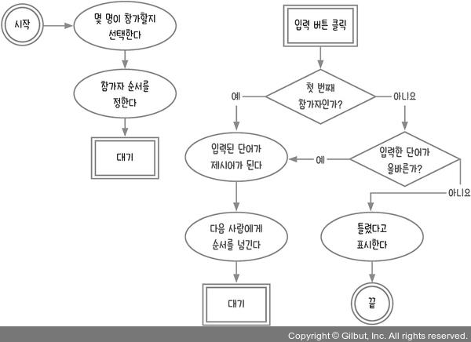

# DOM 객체 다루기

- [3.1 순서도 그리기](#31-순서도-그리기)
  - [순서도의 장점을 한번 생각해보자](#순서도의-장점을-한번-생각해보자)
  - [그렇다면 단점은 무엇일까?](#그렇다면-단점은-무엇일까)
  - [프로그램 절차 알아보기](#프로그램-절차-알아보기)
    - [프로그램 절차를 만들 때의 원칙](#프로그램-절차를-만들-때의-원칙)
    - [일반적인 형태로 바꾼 끝말잇기](#일반적인-형태로-바꾼-끝말잇기)
    - [만든 절차를 예시를 통해 검증해보자](#만든-절차를-예시를-통해-검증해보자)
- [3.2 HTML 화면 만들기](#32-html-화면-만들기)
- [3.3 값 입력받아 변수에 저장하기](#33-값-입력받아-변수에-저장하기)
  - [prompt](#prompt)
  - [alert](#alert)
  - [confirm](#confirm)
- [3.4 HTML 태그 선택하기](#34-html-태그-선택하기)
  - [태그 선택자](#태그-선택자)
  - [다중 선택자](#다중-선택자)
  - [특정한 태그 선택자(HTML id 및 class)](#특정한-태그-선택자html-id-및-class)
    - [HTML id](#html-id)
    - [HTML class](#html-class)
    - [내부 선택자(하위 선택자)](#내부-선택자하위-선택자)
- [3.5 태그에 이벤트 달기](#35-태그에-이벤트-달기)
- [3.6 첫 단어를 입력한 사람인지 판단하기](#36-첫-단어를-입력한-사람인지-판단하기)
- [3.7 올바른 단어인지 판단하기](#37-올바른-단어인지-판단하기)
- [3.8 틀렸을 때 오류 표시하기](#38-틀렸을-때-오류-표시하기)
- [3.9 순서도 최적화하기](#39-순서도-최적화하기)
- [Self Check 쿵쿵따 게임 만들기](#self-check-쿵쿵따-게임-만들기)
  - [순서도 작성하기](#순서도-작성하기)
  - [코드 작성하기](#코드-작성하기)
  - [결과](#결과)

## 3.1 순서도 그리기

> 프로그래밍 언어는 단순히 외운다고 익혀지는 것이 아니라, 프로그램을 실제로 만들어 보고 배웠던 문법이 어디에 어떻게 쓰이는지 몸소 터득해야 합니다. 프로그래밍적으로 사고하지 못한다면 아무리 문법을 외워도 프로그램을 만들 수 없습니다.
> \- 제로초 -

프로그램은 작성한 절차대로 실행된다. 그 절차를 눈으로 식별할 수 있게 하는 것이 바로 순서도이다!

### 순서도의 장점을 한번 생각해보자

- 누구나 쉽게 만들 수 있다.
- 절차를 쉽게 분석할 수 있다.
- 문제를 쉽게 파악할 수 있다.
- 다른 절차들을 하나로 합치기 수월하다.
- 절차를 시각화하여 다른 사람이 쉽게 이해할 수 있다.

### 그렇다면 단점은 무엇일까?

- 작성하는 데 시간이 많이 소요된다.
- 복잡한 프로그램은 순서도로 나타내기 어렵다.
- 순서도 기호를 모르는 사람은 이해하기 어렵다.
- 수정사항이 발생하면 다른 순서도에 영향이 갈 수 있어서 수정하기 어렵다.

상황에 따라 순서도가 필요할 수도, 없을 수도 있으리라 생각한다. 단순한 절차는 순서도를 작성하기보다는 코드로 바로 작성하는 것이 나을 수 있다. 여러 사람과 협업하거나 소통하는 데 있어 순서도가 정말 좋은 방법이라고 생각한다.

### 프로그램 절차 알아보기

끝말잇기 게임의 절차를 말로 설명해보자.

1. 두 명의 참가자가 있다.
2. 첫 번째 참가자가 '하루'라고 말했다.
3. 두 번째 참가자가 '루비'라고 말했다.
4. 다시 첫 번째 참가자가 '비누'라고 말했다.
5. 두 번째 참가자가...
6. 무한 반복

위에 절차는 틀리지 않았지만 일반적이지 않다. 일반적이란 예를 들어 위에서 '하루' ,'루비' 같은 것들을 `단어`라는 일반적인 표현으로 바꿀 수 있다.

> `일반적`이란 표준 국어 대사전에 따르면, 일부에 한정되지 아니하고 전체에 걸치는 것/일부에 한정되지 아니하고 전체에 걸치는 것으로 의미가 풀이된다.

#### 프로그램 절차를 만들 때의 원칙

1. 프로그램 절차의 개수는 정해져 있어야 한다.
2. 각 절차는 항상 같은 내용이어야 한다.
3. 모든 가능성을 고려해야 한다.
4. 예시는 절차를 검증하는 데 사용한다.

프로그램 절차를 만드는 원칙을 지키면서, 끝말잇기 게임을 일반적인 방법으로 바꾸면 아래와 같다.

#### 일반적인 형태로 바꾼 끝말잇기

1. 게임에 몇 명이 참가할지를 선택한다.
2. 참가자 순서를 정한다.
3. 첫 번째 참가자가 어떤 단어를 말한다.
4. 다음 사람이 어떤 단어를 말한다.
5. 절차 4에서 말한 단어가 올바른지 판단한다.
6. 올바르다면 그다음 사람이 어떤 단어를 말한다.
7. 올바르지 않았다면 틀렸다고 표시한다.
8. 게임을 계속 진행한다.

#### 만든 절차를 예시를 통해 검증해보자

1. 세 명이 끝말잇기에 참가한다고 가정한다.
2. 각자에게 1, 2, 3이라는 숫자를 부여한다.
3. 1번 참가자가 ‘하루’라는 단어를 말했다.
4. 다음 참가자(2번 참가자)가 ‘루비’라는 단어를 말했다.
5. 하루’에 ‘루비’로 이어지는 것은 맞다.
6. 따라서 그다음 참가자(3번 참가자)이 ‘오점뭐’라는 단어를 말했다.
7. ‘루비’ 다음에 ‘오점뭐’가 나오는 것은 올바르지 않으므로 틀렸다고 표시한다.
8. 게임을 계속 진행한다.

8번 절차를 보면 3번 참가자가 틀렸는데도 게임을 계속 진행한다. 이러다간 게임이 끝나지 않는다. 탈락자로 참가 인원을 줄이거나 게임을 중단하는 규칙이 필요하다.
하지만 여기서 가장 중요한 것은 5번 절차인데, 다음 사람이 맞았는지 틀렸는지 확인하고 게임을 중단할지 말지 결정해야 하는 지점이다.

이렇게 결과가 한 방향으로 흐르지 않는 것을 `분기점`이라고 한다. 분기점은 '예', '아니오' 두가지의 분기도 처리하지만, 다양한 분기도 존재할 수 있다.


## 3.2 HTML 화면 만들기

VSCode를 실행해서 새로운 html 파일을 만든다. 예를 들어 파일명은 `word-relay.html`처럼 확장자명을 html로 되어있나 잘 확인하자. 내용은 아래와 같이 입력해주거나, 복사 붙여 넣기를 하자.

```html
<!DOCTYPE html>
<html lang="ko">

<head>
  <meta charset="UTF-8" />
  <meta http-equiv="X-UA-Compatible" content="IE=edge" />
  <meta name="viewport" content="width=device-width, initial-scale=1.0" />
  <title>끝말잇기</title>
</head>

<body>
  <div><span id="order">1</span>번째 참가자</div>
  <div>제시어: <span id="word"></span></div>
  <input type="text">
  <button>입력</button>
  <script>
  </script>
</body>

</html>
```

doc를 입력하면 스닙펫이 표시되는데, 누군가 짜놓은 html 코드가 생성돼서 시간을 절약할 수 있다. 아래와 같이 표시될 때 엔터 또는 탭키를 누르면 된다.


입력 후 반드시 `저장(CTRL + S)`버튼을 눌러서 저장하자. 이후 폴더를 열어서 일반 프로그램 실행하듯이 더블 클릭 또는 엔터로 html파일을 실행한다. vscode에서 해당 파일의 폴더를 확인하려면 해당 파일을 마우스로 우측 클릭하여 '파일 탐색기에 표시' 버튼을 클릭하면 폴더가 열릴 것이다.


html 파일을 실행해서 아래 같이 표시되고 있다면 성공이다!


## 3.3 값 입력받아 변수에 저장하기

### prompt

`prompt()`함수를 사용하면 사용자로부터 값을 입력받아올 수 있다.
`prompt('표시할 메시지')`

```html
<script>
  const number = prompt('참가자는 몇 명인가요?');
</script>
```

위와 같이 script 태그안에 코드를 입력하고 HTML 파일을 저장하하고 실행하면 아래처럼 나올 것이다.


이렇게 뜨는 창을 보고 `대화 상자(Dialog Box)`라고 한다. 대화 상자가 뜨는 동안에는 그다음 코드가 실행되지 않고 멈춰 있는다. 그리고 입력한 후 확인을 누르면 변수 number에 입력한 값이 들어간다. 취소를 누르게 되면 null 값이 들어간다. 그런데 숫자를 입력해도 문자열 형태로 들어간다. 예를 들어 4를 입력하고 확인을 누르면 '4'가 들어가는 것이다.

### alert

`alert()`함수는 메시지를 표시하는 대화 상자이다.
`alert('표시할 메시지')`

```html
<script>
  const number = prompt('참가자는 몇 명인가요?');
  alert('참가자는 ' + number + '명 입니다.');
</script>
```


### confirm

`confirm()`함수는 사용자에게 의사를 물어볼 때 사용하는 대화 상자이다.
`confirm('표시할 메시지')`

```html
<script>
  const number = prompt('참가자는 몇 명인가요?');
  alert('참가자는 ' + number + '명 입니다.');
  const bool = confirm('게임을 시작하시겠습니까?');
</script>
```


확인을 누르면 true, 취소를 누르면 false 값을 리턴한다.

## 3.4 HTML 태그 선택하기

input 태그를 이용하여 입력 값을 받으려고 한다. 자바스크립트에서 HTML 태그를 가져오는 것을 `선택`하나고 표현한다. `document.querySelector('선택자');`
`선택자`란 HTML 태그를 선택할 수 있게 도와주는 문자열이다. `html tag`, `html id`, `html class`같은 것들이 선택자에 해당한다.

### 태그 선택자

```html
<script>
  const inputElement = document.querySelector('input');
  console.log(inputElement); // <input type="text">
</script>
```

input 태그가 여러개 있는 경우 제일 위에 있는 첫 번째 태그를 선택한다.

### 다중 선택자

button 태그가 여러개라고 가정해보자. `document.querySelector()`를 이용하면 맨 위의 첫 번째밖에 선택하지 못한다. 이럴 때 모두 가져오기 위해 `document.querySelectorAll()`함수를 이용한다.

```html
<script>
  const buttonElements = document.querySelectorAll('button');
  console.log(buttonElements);
</script>
```

`<button></button>`이 3개인 경우 아래와 같이 콘솔 로그에 찍힐 것이다.


VSCode에서는 코드에 마우스를 올려놓으면 해당 코드에 대한 정보를 얻을 수 있다. 1개일 때는 자료형이 `HTMLButtonElement`였지만, 이번에는 자료형이 `NodeList<HTMLButtonElement>`으로 되어있다는 것을 알 수 있다.


### 특정한 태그 선택자(HTML id 및 class)

#### [HTML id](https://developer.mozilla.org/ko/docs/Web/HTML/Global_attributes/id)

`HTML id`란 `<input id="name">`같이 태그의 id 속성을 말한다. 한 페이지에 한 번만 사용할 수 있는 고유 식별자이다. 태그당 id는 하나의 값만을 사용할 수 있다. HTML 요소를  가져오기 위한 선택자의 식별자로 사용한다.
`document.querySelector('#아이디');`, `document.getElementById('아이디');`

```js
const element = document.getElementById('name'); // HTML Element
const selector = document.querySelector('#name'); // Element
```

다른 태그에도 같은 id 값을 사용할 수는 있다. 태그당 id 속성을 여러 개를 사용하는 것은 안 된다. id 값은 다른 태그에 재사용할 수 없다고 알고 있었는데 실제로는 사용이 가능하다. 내 기억에도 그랬었는데 바뀐 부분이 있었나…?

```html
<button id="tt">입력</button>
<p id="tt">입력</p>
<span id="tt">입력</span>

<!-- 이런 형태는 안된다. -->
<button id="aa bb">버튼</button>
```


그리고 id로 지정한 태그의 경우 브라우저가 DOM Tree를 만들 때 id 속성 값을 변수의 이름으로 객체를 만든다. 그래서 아래와 같이 크롬에서는 id 속성의 객체에 접근이 가능하다.


#### [HTML class](https://developer.mozilla.org/ko/docs/Web/HTML/Global_attributes/class)

`HTML class`란 `<input class='name-style'>`같이 태그의 class 속성을 말한다. class는 여러개 사용할 수 있다. 여러개를 사용할 때는 공백으로 구분한다. CSS 스타일링에 주로 사용한다.
`document.querySelectorAll('.클래스');`, `document.getElementsByClassName('클래스');`

```html
<button class="bt-1 bt-2">버튼1</button>
<button class="bt-2">버튼2</button>
<script>
  const selectors = document.querySelectorAll('.bt-2'); 
  console.log(selectors); // NodeList(2) [button.bt-1.bt-2, button.bt-2]
  const elements = document.getElementsByClassName('bt-2');
  console.log(elements); // HTMLCollection(2) [button.bt-1.bt-2, button.bt-2]
</script>
```

#### 내부 선택자(하위 선택자)

태그 안에 태그가 있는 경우가 있다. 이런 경우에 내부에 있는 태그를 선택하는 방법을 소개한다.
`document.querySelect('선택자 내부선택자 내부선택자...');`

```html
<button>버튼1</button>
<div><button>버튼2</button></div>
<script>
  const element = document.querySelect('div button');
  console.log(element); // <button>버튼2</button>
</script>
```

## 3.5 태그에 이벤트 달기

사용자가 태그와 상호 작용을 할 때 `이벤트`라는 것이 발생한다. 예를 들어 button 태그를 클릭하면 click 이벤트가 발생한다. 자바스크립트는 다양한 이벤트를 자동으로 감지할 수 없다. 그래서 `이벤트 리스너`라는 것을 직접 추가해 자바스크립트가 HTML에서 발생하는 이벤트를 감지할 수 있게 만들어야 한다.
`태그.addEventListener('이벤트 이름', 리스너함수);`

```html
<script>
  const onClickButton = () => {
    console.log('버튼 클릭');
  }
  const $button = document.querySelector('button');
  $button.addEventListener('click', onClickButton);

  /* 
    변수를 사용하지 않아도 가능하지만 
    재사용성을 고려하여 변수를 사용하는 것이 더 나을 수 있다.
  */
  document.querySelector('button').addEventListener('click', onClickButton);
</script>
```

클릭 이벤트는 'click'이다. 버튼을 클릭하면 onClickButton 함수가 실행된다. 이 때 onClickButton 같은 함수를 `콜백 함수(callback function)`라고 한다.
콜백 함수는 특정 작업이 실행되고 난 뒤에 추가로 실행되는 함수를 의미한다.

input 태그에 글자를 입력하면 input 이벤트가 발생한다.

```html
<script>
  const onInput = (event) => {
    console.log('입력한 글자: ', event.target.value);
  }
  const $input = document.querySelector('input');
  $input.addEventListener('input', onInput);
</script>
```

## 3.6 첫 단어를 입력한 사람인지 판단하기

기존 순서도에서 참가자가 단어를 입력하는데 걸리는 시간에 대한 제약이 없으므로 대기해야하는 상황이 발생한다. 그래서 순서도를 아래와 같이 나눈다.


순서도를 왼쪽과 오른쪽으로 나누었다. 왼쪽에는 시작과 대기하기 전까지의 절차이다. 오른쪽에는 대기 이후에 사용자의 입력 버튼 클릭 이벤트 발생 후의 절차이다.

여기서 첫 단어를 입력한 참가자가 맞는지 판단하는 분기점을 추가한다.



첫 단어를 말한 참가자인지 아닌지를 알려면 첫 단어가 무엇인지를 기억하고 있어야 한다.  이렇게 무언가를 기억하려면 변수가 필요하다.


제시어를 저장할 변수를 만든 뒤에 문제점은 다음 참가자가 말하는 단어로 제시어가 바뀌어서 마지막에 입력된 단어를 하나 더 변수에 저장해야한다. 그래서 목적에 맞게 word와 newWord 변수에 나누어서 저장한다.


`태그.textContent`를 사용하면 태그 내부의 문자열을 가져올 수 있다.
`태그.textContent = 값`은 태그 내부의 문자열을 해당 값으로 설정한다는 것이다.

```html
<script>
  const number = Number(prompt('몇 명이 참가하나요?'));
  const $button = document.querySelector('button');
  const $input = document.querySelector('input');
  const $word = document.querySelector('#word');
  let word; // 제시어
  let newWord; // 현재 단어

  const onClickButton = () => {
    if (!word) { // 제시어가 비어 있는가?
      word = newWord; // 입력한 단어가 제시어가 된다.
      $word.textContent = word; // 화면에 제시어 표시
    } else {
      // 비어있지않다.
    }
  };
  const onInput = (event) => {
    newWord = event.target.value; // 입력하는 단어를 현재 단어로
  };

  $button.addEventListener('click', onClickButton);
  $input.addEventListener('input', onInput);
</script>
```

## 3.7 올바른 단어인지 판단하기

끝말잇기에서 단어가 올바른지 판단하려면 `제시어의 끝 글자`와 `현재 입력한 단어의 첫 글자`를 비교하면 된다. 문자열에서 하나의 문자만 가져오는 방법은 `문자열[자릿수]`이다. 배열의 인덱스 접근과 같다.
그리고 배열처럼 문자열의 길이를 `문자열.length`로 구할 수 있다.
그렇다면, 이전의 코드에서 제시어가 비어있지 않는 경우에 대한 코드를 수정할 수 있다.

```html
<script>
  /* ... */
  const onClickButton = () => {
    if (!word) { // 제시어가 비어 있는가?
      word = newWord; // 입력한 단어가 제시어가 된다.
      $word.textContent = word; // 화면에 제시어 표시
    } else { // 비어있지않다.
      if (word[word.length - 1] === newWord[0]) { // 입력한 단어가 올바른가?
        // 올바르다.
        word = newWord; // 현재 단어를 제시어에 저장한다.
        $word.textContent = word; // 화면에 제시어 표시
      } else {
        // 올바르지 않다.
      }
    }
  };
  /* ... */
</script>
```

순서도에 나와있는 `다음 사람에게 순서를 넘긴다.`를 실제 프로그램으로 표현하려면 세부 절차로 나뉘게 되고 판단도 필요하다.

<div>
   
</div>

세 명의 참가자가 있으면 number는 3이 된다. 제시어가 비어있으면 첫 번째 참가자가 입력하고, 제시어가 비어있지 않고 입력한 단어가 올바른 상태에서는 다음 순서로 넘기기 위한 세부적인 절차를 코드로 추가한다.

```html
<script>
  const number = Number(prompt('몇 명이 참가하나요?'));
  const $button = document.querySelector('button');
  const $input = document.querySelector('input');
  const $word = document.querySelector('#word');
  const $order = document.querySelector('#order');
  let word; // 제시어
  let newWord; // 현재 단어

  const onClickButton = () => {
    if (!word) { // 제시어가 비어 있는가?
      word = newWord; // 입력한 단어가 제시어가 된다.
      $word.textContent = word; // 화면에 제시어 표시
      const order = Number($order.textContent);
      if (order + 1 > number) {
        $order.textContent = 1;
      } else {
        $order.textContent = order + 1;
      }
    } else { // 비어 있지 않다.
      if (word[word.length - 1] === newWord[0]) { // 입력한 단어가 올바른가?
        // 올바르다.
        word = newWord; // 현재 단어를 제시어에 저장한다.
        $word.textContent = word; // 화면에 제시어 표시
        const order = Number($order.textContent);
        if (order + 1 > number) {
          $order.textContent = 1;
        } else {
          $order.textContent = order + 1;
        }
      } else {
        // 올바르지 않다.
      }
    }
  };
  const onInput = (event) => {
    newWord = event.target.value; // 입력한 단어를 현재 단어로
  };

  $button.addEventListener('click', onClickButton);
  $input.addEventListener('input', onInput);
</script>
```

## 3.8 틀렸을 때 오류 표시하기

올바르지 않은 단어를 입력한 경우만 처리하면 된다.

```html
<script>
  /* ... */
  const onClickButton = () => {
    if (!word) { // 제시어가 비어 있는가?
      /* ... */
    } else { // 비어 있지 않다.
      if (word[word.length - 1] === newWord[0]) { // 입력한 단어가 올바른가?
        // 올바르다.
        /* ... */
      } else {
        // 올바르지 않다.
        alert('올바르지 않은 단어입니다.');
      }
    }
  };
  /* ... */
</script>
```

단어를 입력하고 나서 입력 버튼을 누르면 다음 참가자로 순서가 넘어가는데, 이전 참가자가 입력한 것이 input 태그에 남아있다. 편의성을 생각하면 input 태그에 입력된 값을 비우고 입력을 바로 할 수 있도록 포커싱 처리를 하면 된다. 이 절차를 추가하면 아래와 같다.


입력한 단어가 틀렸거나, 다음 사람에게 순서를 넘기기 전에 `입력창을 비우고 커서를 둔다`라는 절차가 추가되었다.
`입력태그.value`으로 입력창의 값을 가져올 수 있다.
`입력태그.value = 값`으로 입력창의 값을 변경할 수 있다.
`입력태그.focus()`으로 입력창을 하이라이트(포커싱) 되게 한다. 여기서 `포커싱`이란 입력창을 마우스 왼쪽 클릭해서 입력할 수 있는 활성화된 상태를 말한다.

```html
<script>
  /* ... */
  const onClickButton = () => {
    if (!word) { // 제시어가 비어 있는가?
      /* ... */
      $input.value = '';
      $input.focus();
    } else { // 비어 있지 않다.
      if (word[word.length - 1] === newWord[0]) { // 입력한 단어가 올바른가?
        // 올바르다.
        /* ... */
        $input.value = '';
        $input.focus();
      } else { // 올바르지 않다.
        alert('올바르지 않은 단어입니다!');
        $input.value = '';
        $input.focus();
      }
    }
  };
  /* ... */
</script>
```

## 3.9 순서도 최적화하기

순서도 최적화의 기본은 중복되는 부분을 최대한 줄이는 것이다.
지금까지의 절차에서 중복되는 부분을 찾아보면 `입력창을 비우고 커서를 둔다`, `입력한 단어가 제시어가 된다`, `다음 사람에게 순서를 넘긴다` 중복되는 것을 알 수 있다.

```js
// 입력창을 비우고 커서를 둔다
$input.value = '';
$input.focus();
```

```js
// 입력한 단어가 제시어가 된다
word = newWord;
$word.textContent = word;
// 다음 사람에게 순서를 넘긴다
const order = Number($order.textContent);
if (order + 1 > number) {
  $order.textContent = 1;
} else {
  $order.textContent = order + 1;
}
```

중복된 것을 줄여 순서도를 수정하면 아래와 같다.


합칠 수 있는지 아닌지는 다음과 같이 표를 만들어서 분석하면 도움이 된다고 한다. 제시어가 비어 있다면 단어가 올바른지 아닌지를 볼 필요가 없으므로 삭제선을 그었다.

| 판단1 | 판단2 | 결과 |
|---|---|---|
|제시어가 비어 있다|~~단어가 올바르다~~|입력한 단어가 제시어가 된다|
|제시어가 비어 있다|~~단어가 올바르지 않다~~|입력한 단어가 제시어가 된다|
|제시어가 비어 있지 않다|단어가 올바르다|입력한 단어가 제시어가 된다|
|제시어가 비어 있지 않다|단어가 올바르지 않다|틀렸다고 표시한다|

위의 표를 보면 OR(자바스크립트에서는 ||) 관계가 있음을 파악할 수 있다. 다음의 OR 표는 앞의 표와 구성이 일치한다.

| 첫 번째 조건 | 두 번째 조건 | 최종 결과 |
|---|---|---|
| true | true | true |
| true | false | true |
| false | true | true |
| false | false | false |

AND 관계가 있는 판단은 아래의 표처럼 할 수 있다.

| 첫 번째 조건 | 두 번째 조건 | 최종 결과 |
|---|---|---|
| true | true | true |
| true | false | false |
| false | true | false |
| false | false | false |

최종적으로 최적화 순서도를 코드에 옮기면 아래와 같다. 순서도만 보고 코드로 직접 옮겨 보았다. 자세한 설명을 위해 순서도의 절차를 주석으로 표시헀다.

```html
<script>
  // 시작, 몇 명이 참가할지 선택한다
  const number = Number(prompt('몇 명이 참가하나요?'));
  // 참가자 순서를 정한다. 여기서는 1 -> 2 -> 3 -> 1 같은 순으로 한다.
  const $button = document.querySelector('button');
  const $input = document.querySelector('input');
  const $word = document.querySelector('#word');
  const $order = document.querySelector('#order');
  // 제시어를 저장할 변수를 만든다
  let word; // 제시어
  // 입력한 단어를 저장할 변수를 만든다
  let newWord; // 현재 단어
  // 대기

  // 입력 버튼 클릭
  const onClickButton = () => {
   // 제시어가 비어 있거나 입력한 단어가 올바른가?
   /**
    * 입력한 단어가 올바른 경우를 확인하기 위해
    * 제시어의 마지막 글자와 입력한 단어의 첫 번째 글자와 비교한다.
   */
   if (!word || word[word.length - 1] === newWord[0]) {
    // (예)올바르다
    // 입력된 단어가 제시어가 된다
    word = newWord;
    $word.textContent = word; // 화면에 제시어를 표시한다

    // 다음 사람에게 순서를 넘긴다
    /**
     * number의 숫자만큼 참가자가 참여하므로 다음 순서가
     * 참여한 숫자보다 낮아야 한다.
     * 높거나 같으면 다시 첫 번째 순서로 돌아간다. 
    */
    const order = Number($order.textContent);
    if (order < number) {
     $order.textContent = order + 1;
    } else {
     $order.textContent = 1;
    }
   } else {
    // (아니요)올바르지 않다
    // 틀렸다고 표시한다.
    alert('입력한 값이 틀렸습니다.');
   }

   // 명령창을 비우고 커서를 둔다
   $input.value = '';
   $input.focus();
  };

  // 단어 입력(input 이벤트)
  const onInput = (event) => {
   // 입력한 단어를 저장한다
   newWord = event.target.value;
  };

  $button.addEventListener('click', onClickButton);
  $input.addEventListener('input', onInput);
 </script>
```

> 지금까지 첫 번째 웹 게임인 끝말잇기를 구현해 봤습니다. 코드를 작성하는 것은 부가적인 일이고 순서도 작성이 훨씬 더 중요함을 느꼈을 겁니다. 순서도가 명확하게 정리되지 않으면 코드도 엉망이 됩니다. 생각하는 대로 바로 코딩하지 못해서 답답하겠지만, 반드시 순서도를 그리는 습관을 들여야 합니다. 습관이 되면 머릿속으로 순서도를 그릴 수 있게 되고, 결과적으로 코딩 속도가 빨라집니다.
> \- 제로초 -

순서도의 중요함을 느낀다. 코드는 그저 순서도에 있는 절차를 작성하기만 되는 것이다. 순서도가 잘못되었다면 코드도 잘못된다. 저자가 말하는 대로 바로 코딩으로 옮기고 싶은 욕구가 샘솟았다. 익숙하던 것이니까.. 하지만 익숙하지 않은 순서도를 작성하고 코드로 옮기는 것이 나중에는 더 좋은 결과로 이어질 것이라 믿는다.

## Self Check 쿵쿵따 게임 만들기

직접 풀기 전에 답을 먼저 보지 말아야하고, 순서도를 직접 그려보고 직접 코딩해 봐야한다.
끝말잇기 게임을 응용해 쿵쿵따 게임을 만드는 미션이다.

1. 입력할 수 있는 단어를 세 글자로 고정하라. 세 글자가 아니라면 다시 입력하라고 표시해야한다.
2. 초반에 prompt 함수를 사용해 몇 명이 참가할지를 선택할 때 사용자가 취소를 누르면 다음 코드가 실행되지 않게 처리하라.
3. 개인 미션으로 한글로만 입력할 수 있도록 한다.
4. 개인 미션으로 이전에 입력되었던 단어들을 표시한다.

### 순서도 작성하기

끝말잇기에서 제시어가 세 글자로 고정되는 것 말고는 추가 제약은 없어서 절차는 거의 동일하다. 순서도를 작성해보자.


'변수를 만든다'라는 부분은 절차가 많아지면 빼도 될 것 같다는 생각이 든다. 절차만 작성한 후 필요 데이터를 파악해서 변수로 만들어두는 것이다. '입력된 단어가 제시어가 된다'라는 절차에서 입력된 단어, 제시어라는 두 개의 변수가 필요하다는 것을 알 수 있기 때문이다.

### 코드 작성하기

개인 미션 이외에도 '몇 명이 참가하는지 입력받는다' 절차에 대해 prompt에서 취소를 누르거나 마이너스의 숫자이거나 문자열을 입력하는 경우 대화 상자에 다시 입력하라는 문구를 추가했다.

```html
<html lang="kr">

<head>
  <meta charset="UTF-8">
  <meta http-equiv="X-UA-Compatible" content="IE=edge">
  <meta name="viewport" content="width=device-width, initial-scale=1.0">
  <title>쿵쿵따 게임</title>
</head>

<body>
  <h1 style="text-align: center;">쿵쿵따 게임</h1>
  <div id="view" style="display: flex; flex-direction: column; align-items: center; visibility: hidden;">
    <h2>쿵쿵따 게임에 오신것을 환영합니다.</h2>
    <h4 style="width:40%">쿵쿵따는 세 글자만 입력이 가능하며, 제시어의 마지막 글자가 입력할 단어의 첫 번째 글자가 됩니다. 즐거운 게임이 되시길 바랍니다.</h4>
    <h3>참가자는 총 <span id="number" style="color:chocolate;">?</span>명 입니다.</h3>
    <h3><span id="order" style="color:darkcyan">1</span>번 참가자의 차례입니다.</h3>
    <p>이번 제시어는 <span id="word" style="font-weight: bold; color: tomato;">○○○</span> 입니다.</p>
    <div>
      <input id="input" type="text">
      <button id="push-btn">입력</button>
    </div>
    <p>쿵쿵따리 쿵쿵따~ 쿵쿵따리 쿵쿵따~ 쿵! 쿵! 쿵! 쿵!</p>
    <p id="word-chain" style="max-width: 70%;"></p>
  </div>

  <script>
    // 시작
    // 몇 명이 참가하는지 입력 받는다
    const number = Number(window.prompt('몇 명이 참가하나요?'));
    /**
     * 미션 2. 초반에 prompt 함수를 사용해 몇 명이 참가할지를 선택할 때 
     * 사용자가 취소를 누르면 다음 코드가 실행되지 않게 처리하라.
     * 
     * 사용자가 프롬프트에서 취소를 누르면 false를 반환한다. 그것을 Number로
     * 변환하면 0이 된다. 즉 Number가 0 보다 클 때만 다음 코드가 실행하게 한다.
     * 그리고 혹여나 사용자가 마이너스를 입력하는 경우도 방지하게 된다.
     */
    if (number > 0) {
      // 게임을 시작하면 화면을 활성화
      document.getElementById('view').style.visibility = 'visible';

      // 참가 순서를 정한다
      // 여기서는 1 -> 2 -> 3 -> 1 같은 순으로 한다.

      // Element 바인딩
      const $number = document.getElementById('number');
      const $word = document.getElementById('word');
      /** @type HTMLInputElement JSDoc 주석이다. 변수 타입 힌트를 설정한다. */
      const $input = document.getElementById('input');
      const $order = document.getElementById('order');
      const $button = document.getElementById('push-btn');
      const $wordChain = document.getElementById('word-chain');

      // 참가자 인원 표시
      $number.textContent = number;

      // 제시어를 저장할 변수를 만든다
      let word;
      // 입력할 단어를 저장할 변수를 만든다
      let newWord;
      // 대기

      // 단어 입력(input 이벤트)
      const onInput = (event) => {
        const inputValue = event.target.value;
        // 미션 3. 개인 미션, 한글로만 입력할 수 있도록 한다.
        const regExp = /^[ㄱ-ㅎㅣ가-힣]+$/;

        // 빈문자열이 아닐 때 한글로 입력되었는지 확인한다.
        if (inputValue && !regExp.test(inputValue)) {
          // 한글이 아니라면 경고 메시지를 띄우고 입력창을 비운다.
          alert('한글로만 입력이 가능합니다.');
          event.target.value = '';
          return;
        }

        /**
         * 미션 1. 입력할 수 있는 단어를 세 글자로 고정하라. 
         * 세 글자가 아니라면 다시 입력하라고 표시해야한다.
         */
        if (inputValue.length > 3) {
          alert('단어를 세 글자로 다시 입력해주세요.');
          event.target.value = '';
          return;
        }

        newWord = inputValue;
      };

      // 입력 버튼 클릭(버튼 클릭 이벤트)
      const onClickButton = () => {
        // '입력한 단어가 세글자이면서' '제시어가 비어있거나' '입력한 단어가 올바른가'?
        if (newWord.length === 3 && (!word || word[word.length - 1] === newWord[0])) {
          // 예. 올바르다
          // 입력된 단어가 제시어가 된다
          word = newWord;
          $word.textContent = word;

          // 다음 사람에게 순서를 넘긴다
          const order = Number($order.textContent);
          if (order < number) {
            $order.textContent = order + 1;
          } else {
            $order.textContent = 1;
          }


          // 미션 4. 개인 미션으로 이전에 입력되었던 단어들을 표시한다.
          if ($wordChain.textContent) {
            $wordChain.textContent = `${$wordChain.textContent} -> ${word}`;
          } else {
            $wordChain.textContent = word;
          }

        } else if (newWord.length < 3) {
          // 아니요. 올바르지 않다.
          // 입력한 글자가 세 글자보다 작은가?
          // 예. 세 글자를 입력하라고 표시한다
          alert('입력한 단어가 부족합니다. 세 글자로 입력해주세요.')
        } else {
          // 아니요. 올바르지 않다
          // 입력한 글자가 세 글자보다 작은가?
          // 아니요. 틀렸다고 표시한다
          alert('입력한 단어가 틀렸습니다.');
        }

        // 입력창을 비우고 커서를 포커싱한다
        $input.value = '';
        $input.focus();
      }

      // 이벤트 리스너 설정
      $input.addEventListener('input', onInput);
      $button.addEventListener('click', onClickButton);
    } else {
      alert('취소를 누르셨거나 잘못 입력하셨습니다. \n새로고침(F5)하여 다시 참여해 주시기 바랍니다.')
    }
  </script>
</body>

</html>
```

### 결과

html 파일을 실행하고 게임을 진행한 화면은 아래와 같다.


