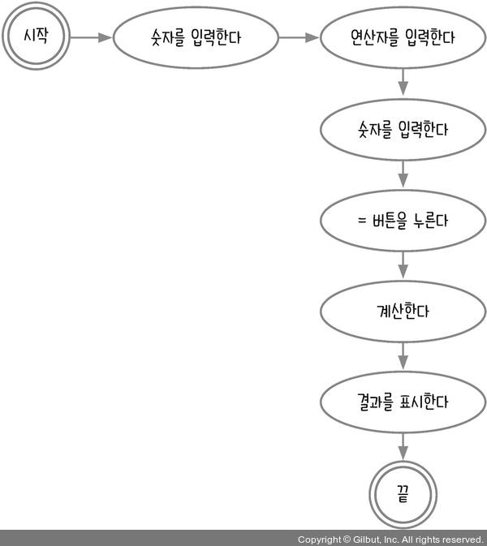
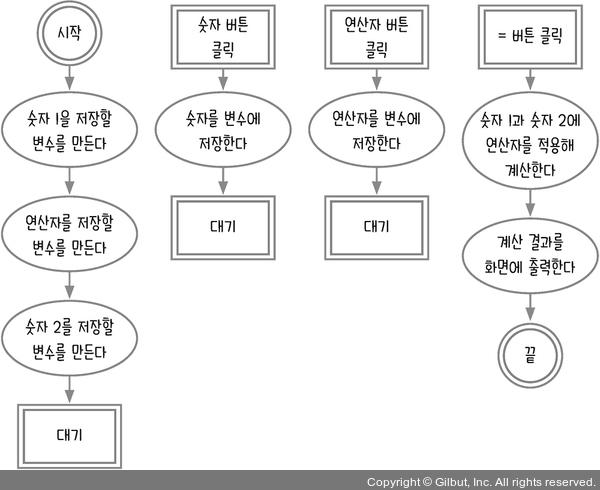
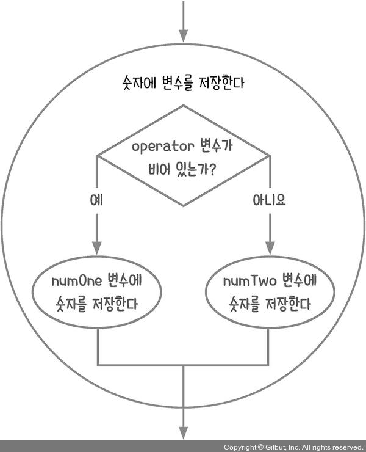
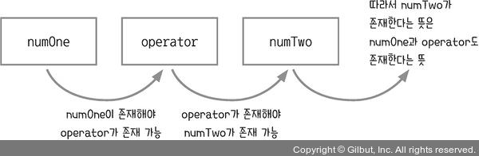
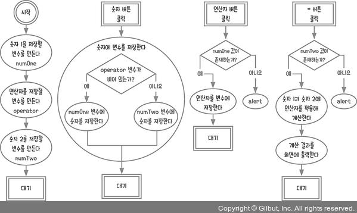

# 함수 사용하기 _계산기

## 4.1 순서도 그리기



단순히 생각하면 위와 같이 그릴 것이다. 자바스크립트 프로그램의 순서도를 만들 때 사용자 이벤트를 기준으로 순서도를 끊어야 한다고 했다. 계산기는 사용자가 숫자나 연산자 버튼을 클릭해 여러 가지 계산을 하는 장치이다. 따라서 클릭 이벤트가 많이 발생한다. 그리고 사용자가 입력한 숫자나 연산자를 저장하고 있어야 = 버튼 클릭 시 결과를 계산할 수 있다.

각각의 경우를 고려해 만든 순서도는 아래와 같다.



'숫자를 변수에 저장한다' 절차에서 숫자 1과 숫자 2중에 어떤 숫자에 저장해야 하는지 판단해야 하는 절차의 순서도는 아래와 같다.



10 - 5를 생각해 보자. 먼저 1을 누르면 숫자 1에 저장하고 연산자를 누르기 전까지 숫자 1에 추가로 저장해야 한다. 문자열 변수를 사용하거나 배열에 담아서 다시 문자열로 만드는 형태로도 할 수 있다.

```js
// 문자열 변수를 사용
const numberOne = '10';
Number(numberOne) === 10; // true

// 숫자를 배열에 담아서 문자열로 변환
[1, 0].join('') === '10'; // true
Number([1, 0].join('')) === 10; // true
```

`join()` 메서드는 배열의 모든 요소를 연결해 하나의 문자열로 만들어준다. 매개변수는 구분할 문자열을 지정하기 위해 구분자를 넣는다. 구분자가 없다면 쉼표로 구분된다. 빈 문자열이면 모든 요소들 사이에 아무 문자도 없이 연결된다.

```js
[1, 0].join() === '1,0'; // true
[1, 0].join('-') === '1-0'; // true
```

이처럼 같은 내용을 구현하더라도 여러 방식으로 구현할 수 있다.

이번에는 숫자를 누르지 않고 연산자 버튼이나 = 버튼을 먼저 누른 경우를 생각해 보자. 이럴 때는 경고 메시지를 띄우거나 입력 처리가 되지 않도록 하면 된다.

연산자 버튼을 누를 때는 숫자 1에 값이 있는지 확인하고, = 버튼을 누를 때는 숫자 2에 값이 있는지 확인하면 된다. 이렇게 변수의 관계와 절차를 생각하면 정리가 된다.



이 내용들을 바탕으로 순서도를 다음과 같이 수정한다.



## 4.2 계산기를 화면 만들고 이벤트 달기
